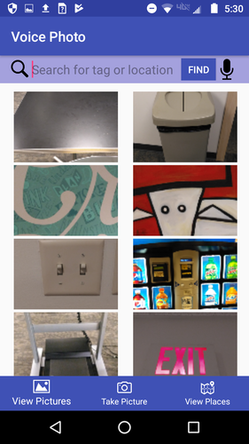

# Voice Photo

### Description
This is an Android application that lets you to take pictures and use your voice to tag them. You can then browse your photos and search with voice commands by tag or location. You can also view a map with markers of the locations of the pictures you've taken.

### Demo
[YouTube video demo of application](https://youtu.be/3m6f2JBsFj0)

### Run Instructions
1. Clone this Github repository with `git clone https://github.com/audreysharp/voice-photo`
2. In the Android Studio menu bar, go to `File` > `Open...` and choose the folder into which you cloned the repository
3. Build the app with `Build` > `Make project`
4. Plug in your Android device and install and run the app with `Run` > `Run 'app'` . 